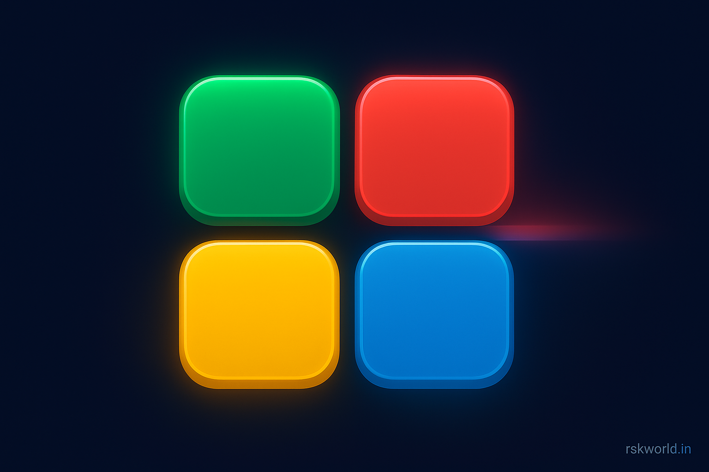

# Color Sequence Memory

Test your memory by repeating the shown color sequence in order. Difficulty ramps up each round with faster playback and longer patterns.

Inspired by the clean, concise layout used in my other project README. See reference: [linear-regression-scratch README](https://github.com/rskworld/linear-regression-scratch/blob/main/README.md).

## Live Preview

- Open `index.php` in your local server (Laragon/XAMPP). On Laragon, this folder is already under `www`, so visit: `https://rskworld.in/games/html5-games/color-sequence/game/`.

## Screenshot



## Features

- Increasing difficulty with each round
- Visual and audio feedback per pad
- Score, level, high-score (localStorage)
- Lives/strikes and Game Over
- Strict mode toggle (one mistake ends game)
- Pause/Resume, Mute/Unmute
- Hints with limited uses per game
- Accessible ARIA labels and focus styles

## Tech Stack

- HTML5, CSS3, JavaScript (Vanilla)

## How to Play

1. Press Start. Watch the sequence play back.
2. Repeat the sequence by clicking the colored pads in order.
3. Each round adds one more color and speeds up slightly.
4. Use Hint to replay the current sequence. Toggle Strict to make it harder.

## Getting Started (Local)

Prerequisites:

- PHP-enabled local server (e.g., Laragon, XAMPP, WAMP).

Steps:

1. Place the project under your web root (already set in this repo path).
2. Start your local server.
3. Visit `http://localhost/games/html5-games/color-sequence/game/`.

## File Structure

```
color-sequence/
  └─ game/
     ├─ index.php       # Game UI and layout
     ├─ script.js       # Game logic (sequence, input, scoring, hints, strict)
     ├─ style.css       # Styles (dark UI, pads, buttons)
     ├─ ads.js          # Simple ad-slot rotation & fallbacks
     ├─ footer.php      # Contact, site, license info
     └─ meta.php        # Meta used by site templates
```

## Ads and Support (Optional)

- Basic ad-slot placeholders rotate sources and fallback to iframe via `ads.js`.
- Optional support via Razorpay embed and UPI QR are integrated in the template pages.

UPI details used on site templates:

- UPI: `rskworld@ptyes`
- Payee: `RSK World`

## Credits & Acknowledgments

- Canvas API, JavaScript, Bootstrap, Font Awesome, and MDN Web Docs references used in broader site templates.

## Contact

- Email: help@rskworld.in
- WhatsApp/Phone: +91 9330539277
- Website: https://rskworld.in

## License

MIT License. See `footer.php` for inline notice.


